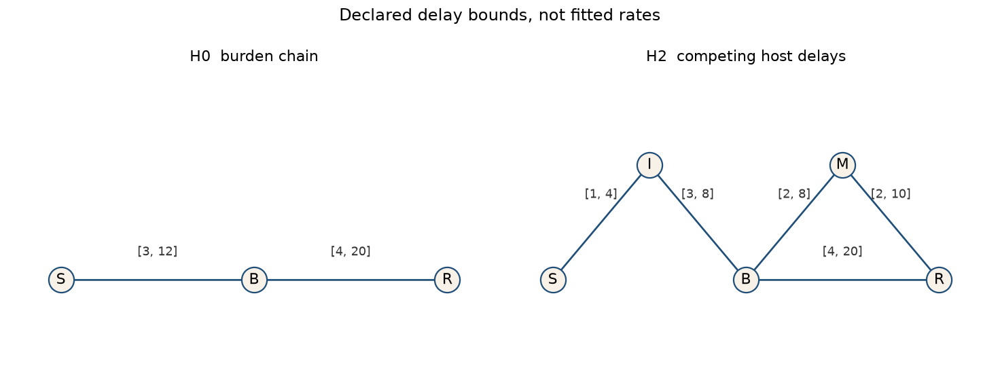
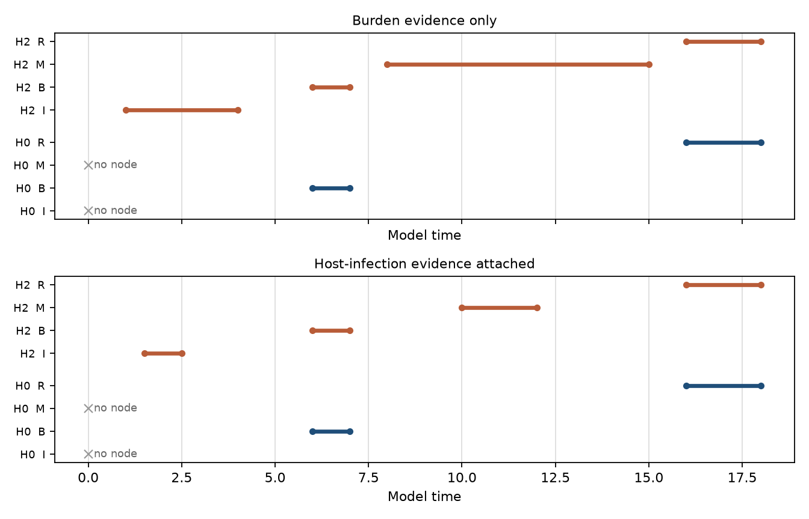
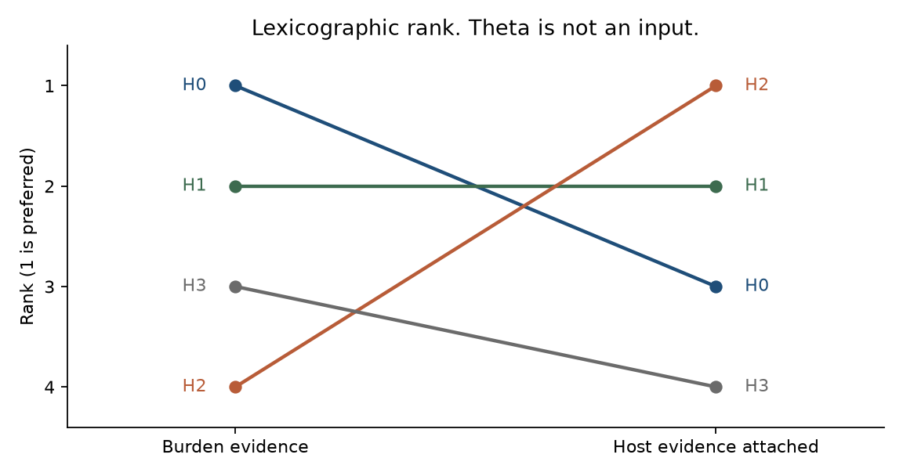
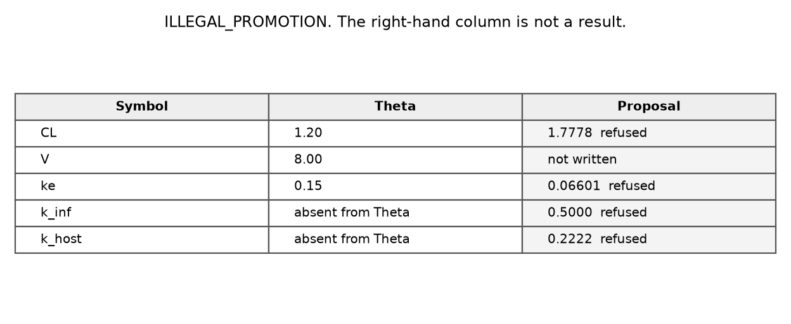

# Host-Infection × Residual-Burden Coupling as a Delayed-Risk Constraint Graph

**Thesis #14. Computational research thesis** (series label NP-08)  
**Author:** Kelechi Emeka Ogbonna  
**Correspondence:** kelechiogbonna300@gmail.com · https://github.com/cloudynirvana/thesis-14-infection-residual-burden-delay-graph  
**Date:** 21 September 2026  
**Format:** B.Sc. project chapters (Nile University style), written as a computational methods manuscript  
**Status:** In-silico delayed-risk graph on declared windows. Not a cohort analysis. Not a clinical result.  
**Citation style:** numbered Vancouver. A `doi:` field appears only where Crossref returned the record.  
**DOI:** none for this document. Do not invent one.

---

## Title page

**HOST-INFECTION × RESIDUAL-BURDEN COUPLING AS A DELAYED-RISK CONSTRAINT GRAPH**

BY

**KELECHI EMEKA OGBONNA**

A COMPUTATIONAL RESEARCH THESIS  
(IN-SILICO DELAYED-RISK GRAPH)

SUBMITTED AS A CITEABLE MANUSCRIPT FOR JOURNAL / THESIS HANDOFF

PROJECT CONFLUENCE  
INDEPENDENT COMPUTATIONAL RESEARCH

SUPERVISOR: not appointed for this deposit

SEPTEMBER 2026

---

## Declaration

I, Kelechi Emeka Ogbonna, declare that this computational research thesis was carried out by me. The ranks, windows and refusal transcript reported here were produced by `sim/delay_graph.py` at seed 20260921. They are not cohort measurements and not patient outcomes. No DOI, ORCID or journal acceptance was invented for this document.

_________________________  
Kelechi Emeka Ogbonna

_______________________  
Date

---

## Abstract

Can infection, marrow-suppression-like host stress, and residual-burden relapse risk be represented as a qualitative delayed-risk graph with explicit non-parameters, such that host-context constraints change hypothesis rank without becoming PK/PD coefficients or care pathways?

Four hypotheses are simple temporal networks on a shared model clock. Delay bounds are syntax, fixed in the script before the rank is read. Evidence windows live in a second store. A third store holds a frozen triple Θ = (CL, V, ke) = (1.2, 8.0, 0.15). The ranker does not read Θ. With residual-burden and relapse-like windows only, the lexicographic key returns H0, H1, H3, H2, with feasible-window volumes 2, 6, 24 and 42. When an infection window and a marrow-stress-like window are attached as constraints, the order becomes H2, H1, H0, H3. H3 is empty: that hypothesis requires the marrow-stress-like event to finish before the burden mark, and the supplied window sits after it. H0 stays feasible and falls from rank 1 to rank 3, because two evidence objects have no node to land on. A volume-only sort, which ignores unhosted evidence, still returns H0 first. The rank change is that unexplained-evidence term.

A second procedure builds k_inf = 1/2, k_host = 2/9, CL = 16/9 and ke = ln(2)/10.5 from the midpoints of the host schedule and then stops. The status is REFUSED. The ranker is not called. SHA-256 of the canonical JSON for Θ is unchanged. The windows are declared, not taken from a registry. Research only. Not a medical device, not a dose, and not a cure.

---

## Keywords

delayed-risk graph; temporal constraint network; waiting time; competing risks; non-parameter; hypothesis rank; residual burden; host infection; marrow-stress-like constraint; refusal; research only

---

## Table of Contents

DECLARATION  
ABSTRACT  
Table of Contents  
List of tables and figures

CHAPTER ONE. INTRODUCTION  
1.1 Background to the study  
1.2 STATEMENT OF RESEARCH PROBLEM  
1.3 JUSTIFICATION OF STUDY  
1.4 AIM AND OBJECTIVES OF THE STUDY  
1.5 SIGNIFICANCE OF THE STUDY  
1.6 SCOPE OF THE STUDY

CHAPTER TWO. LITERATURE REVIEW  
2.1 Labelled waits on one timeline  
2.2 Where a delay usually goes  
2.3 Difference constraints  
2.4 What would count as a coefficient

CHAPTER THREE. MATERIALS AND METHODS  
3.1 Design  
3.2 Three stores  
3.3 Hypothesis syntax  
3.4 Evidence schedules  
3.5 Propagation  
3.6 Rank key, and a volume-only sensitivity  
3.7 The promotion that is refused  
3.8 What was not done

CHAPTER FOUR. RESULTS  
4.1 Burden evidence leaves H0 first  
4.2 Host evidence moves the order  
4.3 What tightens on H2, and what empties H3  
4.4 Volume alone does not move the winner  
4.5 The refusal

CHAPTER FIVE. DISCUSSION, CONCLUSION AND RECOMMENDATION  
5.1 Discussion  
5.2 Conclusion  
5.3 Recommendation

REFERENCES  
DISCLAIMER

---

## List of tables and figures

**Table 3-1.** Three stores.  
**Table 3-2.** Hypothesis syntax: nodes and declared delay bounds.  
**Table 3-3.** Evidence schedules.  
**Table 3-4.** Lexicographic rank key.  
**Table 4-1.** Ranks under burden evidence.  
**Table 4-2.** Ranks under host evidence.  
**Table 4-3.** Tightened delays on H2.  
**Table 4-4.** Frozen Θ and the refused proposal.

**Figure 3-1.** Declared topologies for H0 and H2.  
**Figure 4-1.** Feasible windows for H0 and H2 under both schedules.  
**Figure 4-2.** Lexicographic rank before and after host evidence.  
**Figure 4-3.** Refusal transcript as a table.

Figures are computational diagnostics from seed 20260921. They are not observed event times.

---

# CHAPTER ONE

## 1.0 INTRODUCTION

### 1.1 Background to the study

Cancer incidence is a reason to ask how host events and residual burden can share a clock. It is not a parameter of that clock. GLOBOCAN 2022, published in 2024, estimates incidence and mortality for 36 cancers in 185 countries [1]. A second literature asks how much of worldwide incidence is attributable to infection. For 2018, de Martel and colleagues estimated 2.2 million infection-attributable cancer cases, with an age-standardised rate of 25.0 per 100 000 person-years [2]. Parkin's account for 2002 is the earlier burden statement in the same family [3]. Inflammation is one biological setting in which infection and tumour biology are discussed together. Grivennikov, Greten and Karin review that traffic between immune cells and tumour cells [4]. Those three papers supply a motive for putting an infection-like mark on a timeline. They do not supply an edge bound, and this thesis does not turn their attributable fractions into weights.

The host-stress mark has a narrower empirical neighbour. Bodey, Buckley, Sathe and Freireich described a quantitative relationship between circulating leukocyte level and infection in acute leukemia [5]. The relationship is why an infection-like event and a marrow-suppression-like event can be asked to occupy one model clock. The intervals in Chapter Three are not leukocyte counts, and the rank that comes out of them is not a threshold for action.

Once two kinds of event can fall on one clock, the statistical name for the situation is a competing risk. Prentice and colleagues set out the analysis of failure times when more than one cause is possible [6]. Fine and Gray later wrote a proportional-hazards model for the subdistribution of a competing risk [7]. Gooley, Leisenring, Crowley and Storer restated cumulative incidence as the probability that accumulates while the other causes are present [8]. Putter, Fiocco and Geskus take the same material from that probability into multi-state models [9]. Andersen, Abildstrøm and Rosthøj put the identification in one line: a competing-risks model is already a multi-state model [10]. Andersen and Keiding review event-history multi-state models at larger scale [11]. Hougaard's review covers the same ground from the survival side [12]. When the scientific target is the wait between states, and the records are partly censored, Lagakos, Sommer and Zelen treat that wait as a semi-Markov kernel [13].

Each of those papers estimates a hazard, a subdistribution, a transition intensity, or a kernel. The calculations below do not. A delay, in the applied-mathematics literature, is usually placed inside a differential equation instead. Mackey and Glass put a lag in a physiological control equation and obtained oscillation and chaos [14]. Byrne asked what a lag does to the growth of an avascular tumour [15]. Villasana and Radunskaya wrote a delay-differential tumour model with an immune compartment [16]. Bocharov and Rihan survey numerical treatment of delay equations in the biosciences [17]. Nelson and Perelson analyse delay equations whose lag is an intracellular step in an HIV-1 model [18]. That last lag is a device inside a viral equation. No viral load enters this repository, and no schedule of administration is written down.

The representation that matches the question is a constraint network. Dechter, Meiri and Pearl encode temporal knowledge as difference bounds, tighten them by shortest paths, and declare the set empty when a negative cycle appears [19]. Chapter Three is that construction on four small graphs. The hazards named above remain the literature one would be quoting if the output were a cumulative incidence. It is not.

### 1.2 STATEMENT OF RESEARCH PROBLEM

Can infection, marrow-suppression-like host stress, and residual-burden relapse risk be represented as a qualitative delayed-risk graph with explicit non-parameters, such that host-context constraints change hypothesis rank without becoming PK/PD coefficients or care pathways?

The working form is narrow. There are four hypotheses, each a finite list of difference constraints. There are two evidence schedules, each a list of windows with identifiers. There is one frozen triple, called Θ, whose coordinates look like a clearance, a volume and an elimination rate. The rank is allowed to change when the second schedule is attached. Θ is not allowed to change. A procedure that would manufacture new rate symbols from the windows has to stop and say so.

Two ways of missing the question are easy to write down. One is to score only the width of the feasible set. A hypothesis that ignores host windows can then keep a small volume on the burden margin and look preferred. The other is to convert a window midpoint into a rate and call the rate an update of Θ. Section 3.6 fixes the score so that unhosted evidence is counted before volume. Section 3.7 fixes the second miss by refusing the write.

### 1.3 JUSTIFICATION OF STUDY

Difference constraints of this size can be decided outright. Shostak's loop-residue method is the classical decision procedure for linear difference inequalities [20]. The script uses Floyd-Warshall on the same constraint graph, which on five or six nodes is the same information. Kuipers's qualitative simulation is the neighbouring argument for staying with interval relations when a vector field would invent coordinates the observations do not support [21]. The justification for a thesis is that this small decision is still easy to skip, by dropping the host windows into a coefficient list.

A neighbouring manuscript already refuses a different promotion. Lactate, checkpoint proxies and host bounds may change the rank of an immunometabolic ODE there, and they stay out of its parameter vector [22]. The refusal is adjacent. The object here is the waiting-time graph.

The competing-risks literature explains why the skip is tempting, and why it costs information. Andersen, Geskus, de Witte and Putter list the pitfalls, among them reading a cause-specific hazard as though it were an incidence [23]. Latouche and colleagues argue that a competing-risks report has to keep the cause-specific hazards and the cumulative incidences in view together, rather than collapsing the story onto one coefficient [24]. Wolbers and colleagues ask analysts to state what the competing-risks calculation is for before choosing the estimator [25]. Austin, Lee and Fine wrote the expository account that a clinical reader is likely to meet [26]. Iacobelli's note to investigators in the European Group for Blood and Marrow Transplantation already treats relapse and non-relapse mortality as competing events on a transplant timeline [27]. Beyersmann, Latouche, Buchholz and Schumacher show how to simulate competing-risks data from cause-specific hazards [28]. None of those procedures is run here. They are cited so that a reader can see which object was not built. The windows are not transplant times, and the rank is not a reporting standard.

Bellman and Åström defined structural identifiability as uniqueness of a parameter in an input-output map [29]. A declared delay bound is not that kind of parameter. A clearance that sits in a frozen triple, unread by the ranker, is not identified by being printed. Saltelli and colleagues ask models to expose the assumptions a number depends on [30]. May's warning is the same demand, aimed at biology that borrows equations more readily than it audits them [31]. The auditable pieces in this deposit are the three stores, the rank key, and the refusal code.

### 1.4 AIM AND OBJECTIVES OF THE STUDY

The aim is to determine whether host-infection evidence, kept outside Θ, changes the rank of a delayed-risk constraint graph, and whether a promotion of that evidence into PK-like coefficients can be refused in the same run.

The objectives are:

1. Encode four hypotheses as simple temporal networks with declared delay bounds.
2. Rank them under burden windows alone, and again after infection and marrow-stress-like windows are attached as constraints.
3. Record a volume-only sensitivity that ignores unhosted evidence, so the contribution of that term is visible.
4. Attempt a write from evidence midpoints into rate-like symbols, refuse it, and show that the digest of Θ is unchanged and that the ranker was not called.
5. Keep every numerical claim on the declared generator at seed 20260921.

Non-aims. Estimating a hazard. Integrating a delay-differential equation. Fitting Θ. Reading a rank as a sequence of care.

### 1.5 SIGNIFICANCE OF THE STUDY

The useful product is a separation among three stores that a calibration paragraph often merges. Hypothesis syntax says which waits are posited. Evidence says which windows were supplied. Θ is a frozen triple that the ranker does not take as input. On this generator the separation is doing work: the lexicographic order changes, and the digest of Θ does not.

There is a second separation inside the score. Volume measures how tight the feasible box became. Unhosted evidence measures windows that the hypothesis has no node for. Chapter Four shows a case where the tighter burden margin belongs to a hypothesis that leaves the host windows unexplained, and where the pre-declared key refuses to reward that omission. The volume-only order is published beside the main order so the refusal has a comparison.

What the significance is not: a survival difference, an infection-attributable fraction re-used as a weight, or a reason to order clinical events [1,30].

### 1.6 SCOPE OF THE STUDY

In scope. Four hypotheses, two evidence schedules, one frozen triple, shortest-path consistency on difference constraints, a lexicographic rank, a volume-only sensitivity, and one refused promotion. Labels are model-time marks: origin S, infection-like I, marrow-stress-like M, residual-burden B, relapse-like R.

Out of scope. Guideline-card machinery and profile-export schemas. Any ODE, including an immunometabolic one. Hazard regression, cumulative incidence, and simulation from cause-specific hazards [7,8,28]. Delay-differential integration [15,16,18]. A cohort file. A dose, a clearance estimate, or a care pathway. Regulatory use.

---

# CHAPTER TWO

## 2.0 LITERATURE REVIEW

### 2.1 Labelled waits on one timeline

A competing-risks model starts from a failure time and a cause [6]. The cause-specific hazard for cause k is the instantaneous rate of that cause among subjects still free of every cause. The cumulative incidence of cause k is the probability that the event has occurred and was of that cause [8]. The two functions answer different questions. A high cause-specific hazard can coexist with a modest cumulative incidence if another cause removes people from the risk set quickly. That distinction is why Andersen and co-authors treat careless substitution of one for the other as a pitfall rather than as a shorthand [23], and why Latouche and co-authors want both families of curves reported [24].

Multi-state notation makes the same point with boxes and arrows. A competing-risks model is the multi-state model in which every transition out of the initial state is absorbing [10]. Richer illness-death models add intermediate states [9,11,12]. Semi-Markov kernels go one step further and let the waiting-time law depend on the time already spent in the current state [13]. Iacobelli's note applies this vocabulary to relapse and non-relapse mortality in transplant studies [27]. The vocabulary is the reason the nodes below are labelled rather than pooled. It is not a licence to estimate those kernels on declared intervals.

H2 in Chapter Three is easy to misread against this background. Its code name is `competing_host_delays`. The constraints are a conjunction. The marrow-stress-like event is required to lie inside the relapse wait, and the relapse wait is required as well. The solver does not race two clocks, and it does not censor one event by the other. Joint feasibility on one clock is the whole claim. An exclusive race would have been a different hypothesis class, two graphs rather than one, and it was not the class written down.

### 2.2 Where a delay usually goes

Delay-differential equations put the lag in the vector field. The state at time t depends on the state at t − τ, and τ is either a constant or a distribution [17]. In tumour models the lag has been used for a maturation time or for an immune recruitment time [15,16]. In the HIV-1 equations analysed by Nelson and Perelson, the lag stands for an intracellular step [18]. Mackey and Glass had already shown that a single lag in a feedback law is enough to destabilise a physiological set point [14]. Identifiability theory then asks whether τ, or the rates around it, is fixed by an input-output map [29].

That question is well posed for those equations. It is the wrong slot for the present design. The bounds in Table 3-2 were chosen as syntax. They are not estimated, and there is no trajectory to estimate them from. Promoting a window into a rate, which Section 3.7 refuses, would invent the slot that this literature actually studies, and would do it without the observations that literature requires.

### 2.3 Difference constraints

A simple temporal network stores constraints of the form

a ≤ t_j − t_i ≤ b

on a finite set of event times [19]. Each constraint is a pair of difference inequalities. The feasible set is nonempty if and only if the constraint graph has no negative cycle. Shortest paths from a pinned origin give, for each event, the earliest and latest feasible times. Shostak's procedure decides the same inequality system by another route [20]. On the graphs in this thesis the node count is at most six, counting the pinned origin, so the choice of algorithm does not change the feasible set.

Qualitative simulation, in Kuipers's sense, propagates interval and ordinal relations because a numerical rate would be an extra commitment [21]. The networks below are quantitative at the level of bounds and qualitative at the level of parameters: the bounds are numbers, and Θ is not among the quantities being solved for.

Two consequences matter in Chapter Four. First, a hypothesis that lacks a node cannot attach a window aimed at that node. The window remains in the evidence store and is counted as unexplained. Second, a hypothesis that has the node can still be empty. H3 under the host schedule is that case. Emptiness is a negative cycle, not a large volume.

The propagated windows are projections of the polytope onto each coordinate. The volume used for ranking is the product of those projected lengths, excluding the origin, which is pinned at 0. For the two boxes that were sampled, the product set already implied the edge bounds, and 200 of 200 uniform draws were accepted. That agreement is a fact about those boxes. It is not a general identity between a simple temporal network and its axis-aligned bounding box.

### 2.4 What would count as a coefficient

Fine and Gray's model is a coefficient model. A covariate shifts the subdistribution hazard by a log-linear term [7]. Beyersmann and colleagues simulate the data such a model is fitted to by specifying cause-specific hazards [28]. Bellman and Åström's identifiability question applies to either construction: given the outputs one actually has, is the coefficient unique [29].

Θ in this thesis is shaped like that kind of coefficient and is then withheld from the ranker. CL, V and ke are names with fixed numbers. They do not appear in the constraint list. The promotion in Section 3.7 is the map that would put them, and two new rate symbols, back into the calculation. The map is computed far enough that the refused numbers can be printed, and no further. Austin's expository article describes how a survival analysis with competing risks is actually carried out [26]. Chapter Four is not that analysis. Wolbers's question — what the calculation is for — has a local answer here: it is for the rank of constraint graphs under a key that can see unhosted evidence [25].

---

# CHAPTER THREE

## 3.0 MATERIALS AND METHODS

### 3.1 Design

The windows, the delay bounds and the triple Θ are declared. No registry was downloaded. No event time in Chapter Four is a measurement.

The generator is fixed. Seed 20260921. Software is `sim/delay_graph.py`. Consistency and windows come from Floyd-Warshall on the difference graph. Draws inside two feasible boxes use NumPy's Generator at that seed, 200 accepted points each, recorded as an audit that the boxes are nonempty. The rank itself does not use the draws.

### 3.2 Three stores

**Table 3-1.** Stores. Only the evidence store changes between schedules. Θ does not. Syntax does not.

| Store | Contents | Read by the ranker | Written by evidence |
| --- | --- | --- | --- |
| Syntax | Nodes and delay bounds of H0–H3 | Yes, as constraints | No |
| Evidence | Windows E_I, E_M, E_B, E_R, each with an identifier | Yes, if the node exists | The schedule is this store |
| Θ | CL = 1.2, V = 8.0, ke = 0.15 | No | No |

The digest of Θ is SHA-256 of the UTF-8 JSON object `{"CL":1.2,"V":8.0,"ke":0.15}`, with keys sorted and no spaces. That string is 2233ffdf1e0ab6c1bb4939f3cdedd311423849e9c92fca0089626f9e3d5715b6. It is recomputed after the refused promotion.

### 3.3 Hypothesis syntax

Event labels are S (origin), I (infection-like), M (marrow-suppression-like host stress), B (residual-burden mark) and R (relapse-like mark). Time is model time. S is pinned at 0 whenever it is present. An edge (source, target, lo, hi) means lo ≤ t_target − t_source ≤ hi.

**Table 3-2.** Declared bounds. These numbers are literals in the script. They were not fitted.

| Id | Code name | Nodes | Delay bounds |
| --- | --- | --- | --- |
| H0 | burden_chain | S, B, R | S→B in [3, 12]; B→R in [4, 20] |
| H1 | infection_serial | S, I, B, R | S→I in [1, 4]; I→B in [3, 8]; B→R in [4, 20] |
| H2 | competing_host_delays | S, I, M, B, R | S→I in [1, 4]; I→B in [3, 8]; B→M in [2, 8]; M→R in [2, 10]; B→R in [4, 20] |
| H3 | conjunction_before_burden | S, I, M, B, R | S→I in [1, 4]; S→M in [1, 6]; I→B in [2, 8]; M→B in [2, 8]; B→R in [4, 20] |

H0 posits a burden mark and a relapse-like mark. H1 adds an infection-like predecessor of the burden mark. H2 keeps that predecessor and also requires M to fall strictly inside the relapse wait: B before M before R, together with a direct B→R bound. The conjunction is what the code name abbreviates. It is not an exclusive race (Section 2.1). H3 requires both host events to finish before the burden mark.

**Figure 3-1.** H0 is the chain. H2 adds I before B, and M between B and R, with the direct relapse edge kept. Labels are the declared bounds from Table 3-2, not fitted waits.

### 3.4 Evidence schedules

**Table 3-3.** Windows. A window on a missing node is unexplained. It is not dropped, and it is not copied into Θ.

| Schedule | Windows |
| --- | --- |
| Burden | E_B: t_B in [6, 7]; E_R: t_R in [16, 18] |
| Host | E_I: t_I in [1.5, 2.5]; E_M: t_M in [10, 12]; E_B and E_R as in the burden schedule |

The host schedule adds two windows. It does not edit the burden windows, the syntax, or Θ. E_M sits after E_B on the model clock. That order is part of the declared evidence. It is the reason H3 can become empty while H2 can remain feasible.

### 3.5 Propagation

Constraints from syntax, and from evidence whose node belongs to the hypothesis, are loaded together. Each bound a ≤ t_j − t_i ≤ b contributes the inequalities t_j − t_i ≤ b and t_i − t_j ≤ −a. The origin node O carries t_S = 0. Floyd-Warshall then yields the tightest difference bounds. A negative diagonal entry is recorded as inconsistency. For a consistent network the earliest time of an event is minus the shortest path back to O, and the latest time is the shortest path from O.

Volume is the product of (latest − earliest) over every node except S. S has width 0 by the pin. An inconsistent hypothesis has no volume.

Induced edge delays are the tightest bounds on t_target − t_source after propagation. They can be narrower than the declared syntax. Chapter Four reports them for the structural edges. Bookkeeping edges from O are the windows themselves and are left in `sim/results.json` without a separate table.

### 3.6 Rank key, and a volume-only sensitivity

**Table 3-4.** Sort order for the lexicographic key. The first column that differs decides the rank. Rank 1 is the preferred hypothesis.

| Priority | Term | Preferred value |
| --- | --- | --- |
| 1 | Consistency | Feasible before infeasible |
| 2 | Unexplained evidence | Fewer identifiers |
| 3 | Volume | Smaller product of window widths |
| 4 | Node count | Fewer nodes |
| 5 | Hypothesis id | Lexicographic id, as a terminal tie-break |

The key is written in the script above the ranker. Unhosted evidence is counted before volume so that a narrow burden margin cannot outrank a hypothesis that actually hosts the windows.

The sensitivity drops terms 2 and 4. Its key is consistency, then volume, then hypothesis id. It is computed on the same rows. It is not the result in Table 4-2. It exists because, under the host schedule, H0 and H2 do not agree about which of those two keys should win.

### 3.7 The promotion that is refused

The refused map reads the host schedule only. Midpoints are t_I = 2, t_M = 11, t_B = 6.5 and t_R = 17. From those four numbers it builds

k_inf = 1 / t_I = 1/2,

k_host = 1 / (t_M − t_B) = 1/4.5 = 2/9,

CL = k_host × V = 16/9,

ke = ln(2) / (t_R − t_B) = ln(2) / 10.5.

V is read so that CL can be proposed. V is not among the keys written. The source store is evidence. k_inf and k_host are new keys. CL and ke would overwrite entries of Θ. Any one of those three facts is enough for the guard. The guard records status REFUSED and code ILLEGAL_PROMOTION, returns Θ unchanged, and does not call the ranker. The proposal is stored under `proposal_not_a_result`.

### 3.8 What was not done

No cohort times were fitted. No hazard, subdistribution, or semi-Markov kernel was estimated [7,13,28]. No delay-differential equation was integrated [17]. Θ was not optimised. Global identifiability software was not run, because the delay bounds are not a parameter vector in the sense of Bellman and Åström [29]. No dose and no care sequence was computed.

---

# CHAPTER FOUR

## 4.0 RESULTS

### 4.1 Burden evidence leaves H0 first

Under the burden schedule every hypothesis is feasible, and every hypothesis has zero unexplained identifiers, because I and M are not supplied. The rank is then the volume order. Table 4-1 is that order.

**Table 4-1.** Burden schedule. Volume is the product of free window widths. H0 is rank 1.

| Id | Rank | Feasible | Unexplained | Volume | Nodes |
| --- | --- | ---: | ---: | ---: | ---: |
| H0 | 1 | yes | 0 | 2 | 3 |
| H1 | 2 | yes | 0 | 6 | 4 |
| H3 | 3 | yes | 0 | 24 | 5 |
| H2 | 4 | yes | 0 | 42 | 5 |

The burden and relapse-like windows survive unchanged on every hypothesis: t_B stays in [6, 7] and t_R stays in [16, 18]. Their widths are 1 and 2, and the product 2 is H0's volume. The induced relapse delay B→R tightens from the declared [4, 20] to [9, 12] on every feasible hypothesis. That tightening is the burden evidence doing ordinary propagation. It does not by itself rank the host structure, because every hypothesis sees it.

H1 adds a free infection-like time in [1, 4]. The width is 3, the volume is 3 × 1 × 2 = 6, and the induced delay I→B tightens from [3, 8] to [3, 6]. The upper end moves because t_B ≤ 7 and t_I ≥ 1.

H3 adds both host events as latent predecessors of B. After propagation, t_I stays in [1, 4] and t_M lies in [1, 5]. The structural upper bound on t_M is 6. It is cut to 5 because t_B ≤ 7 and the edge M→B requires t_B − t_M ≥ 2. Volume is 3 × 4 × 1 × 2 = 24.

H2's latent marrow-stress-like time is the wide one. With t_B in [6, 7] and B→M declared as [2, 8], t_M lies in [8, 15]. The relapse window does not cut that interval further. Width 7, together with t_I in [1, 4], gives volume 3 × 7 × 1 × 2 = 42. H2 is last. A host node with no host evidence is a loose coordinate, and the sharpness term penalises it. That is the burden-only result.

### 4.2 Host evidence moves the order

The host schedule attaches E_I and E_M and leaves E_B and E_R as they were. Table 4-2 is the lexicographic rank.

**Table 4-2.** Host schedule. H2 is rank 1. H3 is empty. H0 remains feasible and is rank 3.

| Id | Rank | Feasible | Unexplained | Volume | Nodes |
| --- | --- | ---: | ---: | ---: | ---: |
| H2 | 1 | yes | 0 | 4 | 5 |
| H1 | 2 | yes | 1 (E_M) | 2 | 4 |
| H0 | 3 | yes | 2 (E_I, E_M) | 2 | 3 |
| H3 | 4 | no | 0 | — | 5 |

H0's windows do not move. t_B is still in [6, 7] and t_R is still in [16, 18], volume still 2. The hypothesis is consistent. It falls from rank 1 to rank 3 because E_I and E_M have nowhere to attach. Feasibility of the burden margin does not preserve the rank.

H1 hosts E_I, E_B and E_R. The infection window replaces the latent interval: t_I lies in [1.5, 2.5], and I→B tightens to [3.5, 5.5]. Volume falls from 6 to 2. One identifier, E_M, is still unexplained, so H1 ranks behind H2 even though its volume is smaller than H2's.

H2 hosts all four identifiers. Volume falls from 42 to 4. The node windows under this schedule are the evidence windows themselves: t_I in [1.5, 2.5], t_M in [10, 12], t_B in [6, 7], t_R in [16, 18]. Widths 1, 2, 1 and 2 multiply to 4. Node windows that match the evidence are not the same statement as unchanged edge delays. The edge delays tighten, and Section 4.3 records them.

H3 also hosts all four identifiers, and the constraint set is empty. Unexplained count 0 does not rescue it. The key places every infeasible hypothesis after every feasible one. H3 is rank 4.

**Figure 4-1.** Horizontal segments are earliest-to-latest times. A cross marked "no node" is an evidence label the hypothesis cannot host. Model time is the horizontal axis.

**Figure 4-2.** Rank 1 is preferred. H0 moves from 1 to 3. H2 moves from 4 to 1. H3 moves from 3 to 4 and is the empty network on the right-hand side. Θ is not an input to either column.

### 4.3 What tightens on H2, and what empties H3

**Table 4-3.** Induced delays on H2. Each cell is [tight lower, tight upper], with the declared syntax underneath it in the text of Section 3.3.

| Edge | Burden schedule | Host schedule | Declared syntax |
| --- | --- | --- | --- |
| S→I | [1, 4] | [1.5, 2.5] | [1, 4] |
| I→B | [3, 6] | [3.5, 5.5] | [3, 8] |
| B→M | [2, 8] | [3, 6] | [2, 8] |
| M→R | [2, 10] | [4, 8] | [2, 10] |
| B→R | [9, 12] | [9, 12] | [4, 20] |

B→R is already [9, 12] under burden evidence, and the host windows do not move it. The host schedule tightens the four edges that touch I or M. B→M moves from the full declared interval [2, 8] to [3, 6]. M→R moves from [2, 10] to [4, 8]. Those are waiting-time constraints. They are not rates.

H3 is empty for a one-line reason. The edge M→B requires t_M ≤ t_B − 2. The host windows require t_M ≥ 10 and t_B ≤ 7, so t_M ≥ 10 > 5 ≥ t_B − 2. The two demands cannot hold together. The negative cycle is that contradiction. H2 accepts the same windows because it places M after B, which is where E_M sits.

Sampling does not change these bounds. Under burden evidence, H0 accepted 200 of 200 proposals drawn uniformly in its windows. Under host evidence, H2 accepted 200 of 200. In both boxes the projected windows already implied the edge inequalities, so rejection never fired. The draws are an audit of nonemptiness at seed 20260921. They are not a survival curve.

### 4.4 Volume alone does not move the winner

The volume-only key returns H0, H1, H3, H2 under burden evidence, the same order as Table 4-1, because unexplained counts are all zero there. Under host evidence it returns H0, H1, H2, H3.

H0 and H1 both have volume 2 on the host schedule. The sensitivity breaks that tie by hypothesis id, so H0 precedes H1. H2, with volume 4, follows both. H3 is last because it is empty. The preferred hypothesis under this key is still H0, the winner of the burden schedule. Attaching host windows tightens H2 from volume 42 to volume 4, and that tightening is real. It is not enough, on a pure sharpness score, to pass a burden chain whose volume remains 2.

The lexicographic key and the volume-only key therefore disagree on the host schedule, and they agree on the burden schedule. The disagreement is the result that the unexplained-evidence term was introduced to make visible. Host-context constraints change the rank when the key is allowed to see them as unhosted or hosted objects. They do not change the winner when the score looks only at box volume.

### 4.5 The refusal

The promotion of Section 3.7 returns status REFUSED and code ILLEGAL_PROMOTION. The transcript gives three reasons: the source store is evidence; the new keys are the PK-like symbols k_host and k_inf; the existing keys CL and ke would be overwritten from evidence. The ranker-called flag is false.

**Table 4-4.** Θ beside the proposal. The proposal column is not a result. Stored floats are 0.5, 0.2222…, 1.777… and 0.066014…. The fractions in Section 3.7 are the exact map.

| Symbol | Θ before and after | Proposal |
| --- | --- | --- |
| CL | 1.2 | 16/9, refused |
| V | 8.0 | not written |
| ke | 0.15 | ln(2)/10.5, refused |
| k_inf | absent | 1/2, refused |
| k_host | absent | 2/9, refused |

The digest before the guard equals the digest after it: 2233ffdf1e0ab6c1bb4939f3cdedd311423849e9c92fca0089626f9e3d5715b6. Θ in `sim/results.json` is the same object on both sides of the guard. The host schedule still produces Table 4-2. The rank moved. The triple did not.

**Figure 4-3.** Right-hand column from the refusal transcript, four-decimal display for CL, k_inf and k_host, five-decimal display for ke. Grey cells are the refused proposal. They are not written back.

---

# CHAPTER FIVE

## 5.0 DISCUSSION, CONCLUSION AND RECOMMENDATION

### 5.1 Discussion

The question in Section 1.2 has a direct answer on this generator. Infection-like and marrow-suppression-like windows can be carried as difference constraints. Doing so changes the lexicographic rank from H0, H1, H3, H2 to H2, H1, H0, H3. The same run leaves Θ at its declared values and refuses the map that would have turned window midpoints into k_inf, k_host, a new CL and a new ke.

The mechanism is visible because two scores were computed. Volume records sharpness. On the host schedule, H0's volume stays 2 and H2's volume falls only to 4, so sharpness still prefers H0. The unexplained-evidence count records whether E_I and E_M met a node. That count is 2 for H0, 1 for H1 and 0 for H2, and it is consulted before volume. H2 therefore ranks first even though its box is larger than H0's. A reader who published only the volumes would be entitled to keep H0. The key that demotes H0 was declared in Table 3-4 before the order was read, and the sensitivity that omits the demotion is in Section 4.4.

H3 is the other half of the same point. It hosts every identifier and it is empty, because a predecessor constraint on M cannot meet a window that opens at time 10 while B closes at time 7. An empty network is not a tight network. Sorting by unexplained count alone, without the consistency term, would have treated H3 as a peer of H2. The key does not.

H0's fall is easy to over-read. The burden chain remains feasible. Its constraint set under the host schedule is the same set it had under the burden schedule, and the relapse delay remains [9, 12]. What changes is the rank, once evidence exists that the chain cannot host. Rank 3, with the network still feasible, is the accurate report.

The name on H2 needs the same care. Joint feasibility of a nested host-stress wait and a relapse wait is a constraint pattern. It is not a cause-specific hazard and not a subdistribution [6,7,10]. The competing-risks citations in Chapter Two are there to name the statistical object that shares a timeline among labelled events, and to mark the estimators that were not run [8,23,24,28]. Iacobelli's transplant note is in that list for the same reason [27]. The windows are not conditioning times.

Limitations, kept specific:

- The windows and the syntax bounds are declared literals. A different host window can reorder the hypotheses. E_M opening at 10 is what empties H3 and seats M inside H2's relapse wait.
- Volume is a product of projected lengths. On these two sampled boxes the projections implied the edges. On a tighter network they need not [19].
- The volume-only tie between H0 and H1 under host evidence is broken by hypothesis id. That tie-break is declared, and it is idle in the lexicographic result, where the unexplained counts already differ.
- Four hypotheses are a designed set, not a catalogue of waiting-time models [13,17].
- Θ's coordinates are shaped like pharmacokinetic symbols so that a promotion has a target. They are not a compartment fit. The refused numbers are not clearances.
- No cohort, no censoring mechanism, and no delay-differential trajectory was used [2,18,26].
- One seed governs the audit draws. The ranks do not depend on those draws. They depend on the constraints.

### 5.2 Conclusion

Can infection, marrow-suppression-like host stress, and residual-burden relapse risk be represented as a qualitative delayed-risk graph with explicit non-parameters, such that host-context constraints change hypothesis rank without becoming PK/PD coefficients or care pathways? On the generator in Chapter Three, yes. The rank changes. Θ does not. The promotion into rate-like symbols is refused.

1. Under burden windows alone, every hypothesis is feasible and the order is H0, H1, H3, H2, with volumes 2, 6, 24 and 42. The latent host coordinates are what make H2 last.
2. Under the host schedule the order is H2, H1, H0, H3. H2 hosts all four evidence identifiers and has volume 4. H1 leaves E_M unexplained. H0 leaves E_I and E_M unexplained and remains feasible at volume 2. H3 is empty.
3. The induced delays on H2 that touch I or M tighten when the host windows are attached. The relapse delay B→R is already [9, 12] under burden evidence and stays there.
4. A volume-only sort on the host schedule returns H0, H1, H2, H3. The winner does not move. The rank change in the main table is the unexplained-evidence term.
5. The map with k_inf = 1/2, k_host = 2/9, CL = 16/9 and ke = ln(2)/10.5 is refused. The ranker is not called. The SHA-256 digest of Θ is 2233ffdf1e0ab6c1bb4939f3cdedd311423849e9c92fca0089626f9e3d5715b6 on both sides of the guard.
6. The numerical claims above are properties of the declared generator at seed 20260921. They are not cohort estimates and not clinical effects [30,31].

### 5.3 Recommendation

1. Keep syntax, evidence and Θ in separate stores, and state which store a new number is allowed to enter [19,30].
2. Declare the rank key before publishing an order. If unhosted evidence is meant to demote a hypothesis, put that term ahead of volume, and publish the volume-only order beside it.
3. Report an empty network as empty. Do not replace it with a large finite volume, and do not drop it from the table if the emptiness is the scientific point, as it is for H3.
4. When a code name suggests an exclusive race, state whether the constraints are a conjunction. H2's name is easy to hear as a competing-risks estimator. The constraints are joint bounds [6,10].
5. Refuse maps from waiting-time midpoints onto clearance, elimination, or new rate symbols. Store the proposal outside the result object, and recompute the digest of Θ [29].
6. Leave dosing rules, device claims and care sequences outside papers of this type [26,30].
7. A document DOI, if one is minted later, belongs in `CITATION.cff` only after it exists.

---

## REFERENCES

Journal items use Vancouver form. DOI strings are those returned by Crossref for the cited version. The Gooley DOI is written with escaped angle brackets so the string survives HTML conversion; the resolved identifier is the Crossref record for that paper. Internet items have no `doi:` field. This document has no DOI.

1. Bray F, Laversanne M, Sung H, Ferlay J, Siegel RL, Soerjomataram I, et al. Global cancer statistics 2022: GLOBOCAN estimates of incidence and mortality worldwide for 36 cancers in 185 countries. CA Cancer J Clin. 2024;74(3):229-263. doi:10.3322/caac.21834.
2. de Martel C, Georges D, Bray F, Ferlay J, Clifford GM. Global burden of cancer attributable to infections in 2018: a worldwide incidence analysis. Lancet Glob Health. 2020;8(2):e180-e190. doi:10.1016/S2214-109X(19)30488-7.
3. Parkin DM. The global health burden of infection-associated cancers in the year 2002. Int J Cancer. 2006;118(12):3030-3044. doi:10.1002/ijc.21731.
4. Grivennikov SI, Greten FR, Karin M. Immunity, inflammation, and cancer. Cell. 2010;140(6):883-899. doi:10.1016/j.cell.2010.01.025.
5. Bodey GP, Buckley M, Sathe YS, Freireich EJ. Quantitative relationships between circulating leukocytes and infection in patients with acute leukemia. Ann Intern Med. 1966;64(2):328-340. doi:10.7326/0003-4819-64-2-328.
6. Prentice RL, Kalbfleisch JD, Peterson AV Jr, Flournoy N, Farewell VT, Breslow NE. The analysis of failure times in the presence of competing risks. Biometrics. 1978;34(4):541-554. doi:10.2307/2530374.
7. Fine JP, Gray RJ. A proportional hazards model for the subdistribution of a competing risk. J Am Stat Assoc. 1999;94(446):496-509. doi:10.1080/01621459.1999.10474144.
8. Gooley TA, Leisenring W, Crowley J, Storer BE. Estimation of failure probabilities in the presence of competing risks: new representations of old estimators. Stat Med. 1999;18(6):695-706. doi:10.1002/(SICI)1097-0258(19990330)18:6&lt;695::AID-SIM60&gt;3.0.CO;2-O.
9. Putter H, Fiocco M, Geskus RB. Tutorial in biostatistics: competing risks and multi-state models. Stat Med. 2007;26(11):2389-2430. doi:10.1002/sim.2712.
10. Andersen PK, Abildstrøm SZ, Rosthøj S. Competing risks as a multi-state model. Stat Methods Med Res. 2002;11(2):203-215. doi:10.1191/0962280202sm281ra.
11. Andersen PK, Keiding N. Multi-state models for event history analysis. Stat Methods Med Res. 2002;11(2):91-115. doi:10.1191/0962280202SM276ra.
12. Hougaard P. Multi-state models: a review. Lifetime Data Anal. 1999;5(3):239-264. doi:10.1023/A:1009672031531.
13. Lagakos SW, Sommer CJ, Zelen M. Semi-Markov models for partially censored data. Biometrika. 1978;65(2):311-317. doi:10.1093/biomet/65.2.311.
14. Mackey MC, Glass L. Oscillation and chaos in physiological control systems. Science. 1977;197(4300):287-289. doi:10.1126/science.267326.
15. Byrne HM. The effect of time delays on the dynamics of avascular tumor growth. Math Biosci. 1997;144(2):83-117. doi:10.1016/S0025-5564(97)00023-0.
16. Villasana M, Radunskaya A. A delay differential equation model for tumor growth. J Math Biol. 2003;47(3):270-294. doi:10.1007/s00285-003-0211-0.
17. Bocharov GA, Rihan FA. Numerical modelling in biosciences using delay differential equations. J Comput Appl Math. 2000;125(1-2):183-199. doi:10.1016/S0377-0427(00)00468-4.
18. Nelson PW, Perelson AS. Mathematical analysis of delay differential equation models of HIV-1 infection. Math Biosci. 2002;179(1):73-94. doi:10.1016/S0025-5564(02)00099-8.
19. Dechter R, Meiri I, Pearl J. Temporal constraint networks. Artif Intell. 1991;49(1-3):61-95. doi:10.1016/0004-3702(91)90006-6.
20. Shostak R. Deciding linear inequalities by computing loop residues. J ACM. 1981;28(4):769-779. doi:10.1145/322276.322288.
21. Kuipers B. Qualitative simulation. Artif Intell. 1986;29(3):289-338. doi:10.1016/0004-3702(86)90073-1.
22. Ogbonna KE. Immunometabolic tumour-immune interaction ODEs under explicit non-parameters: lactate, checkpoint proxies, and host constraints that must not enter Θ [Internet]. Thesis #10 computational research thesis. 2026 [cited 2026 Sep 21]. Available from: https://github.com/cloudynirvana/thesis-10-immunometabolic-refuse-as-parameter
23. Andersen PK, Geskus RB, de Witte T, Putter H. Competing risks in epidemiology: possibilities and pitfalls. Int J Epidemiol. 2012;41(3):861-870. doi:10.1093/ije/dyr213.
24. Latouche A, Allignol A, Beyersmann J, Labopin M, Fine JP. A competing risks analysis should report results on all cause-specific hazards and cumulative incidence functions. J Clin Epidemiol. 2013;66(6):648-653. doi:10.1016/j.jclinepi.2012.09.017.
25. Wolbers M, Koller MT, Stel VS, Schaer B, Jager KJ, Leffondré K, et al. Competing risks analyses: objectives and approaches. Eur Heart J. 2014;35(42):2936-2941. doi:10.1093/eurheartj/ehu131.
26. Austin PC, Lee DS, Fine JP. Introduction to the analysis of survival data in the presence of competing risks. Circulation. 2016;133(6):601-609. doi:10.1161/CIRCULATIONAHA.115.017719.
27. Iacobelli S. Suggestions on the use of statistical methodologies in studies of the European Group for Blood and Marrow Transplantation. Bone Marrow Transplant. 2013;48 Suppl 1:S1-S37. doi:10.1038/bmt.2012.282.
28. Beyersmann J, Latouche A, Buchholz A, Schumacher M. Simulating competing risks data in survival analysis. Stat Med. 2009;28(6):956-971. doi:10.1002/sim.3516.
29. Bellman R, Åström KJ. On structural identifiability. Math Biosci. 1970;7(3-4):329-339. doi:10.1016/0025-5564(70)90132-X.
30. Saltelli A, Bammer G, Bruno I, Charters E, Di Fiore M, Didier E, et al. Five ways to ensure that models serve society: a manifesto. Nature. 2020;582(7813):482-484. doi:10.1038/d41586-020-01812-9.
31. May RM. Uses and abuses of mathematics in biology. Science. 2004;303(5659):790-793. doi:10.1126/science.1094442.

---

## Disclaimer

Research manuscript. Not a medical device, not clinical decision support, not a diagnostic or therapeutic product, and not a protocol [30]. Ranks and windows are properties of the declared generator. They are not patient outcomes. No document DOI is registered.

Deposit: https://github.com/cloudynirvana/thesis-14-infection-residual-burden-delay-graph
